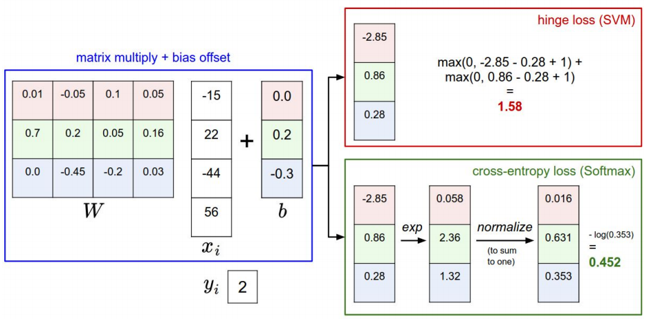

## Loss function

### SVM

Given an example (xi, yi) where xi is
the image, yi is the integer  label, and `s` =
f(xi, W)

The SVM loss has the form:

Li=∑j≠imax(0,sj−syj+Δ)

and the full training loss is the mean over all examples in the training
data:

L = 1 / N * ∑j to NLi

**Regularization**. There is one bug with the loss function we presented
above because there are multiple set `W` that will correctly classify
all examples. Hence, we need an extra value to weight those solutions called
**regularization penalty** `R(W)`.

So the training loss full becomes:

L = 1 / N * ∑j to NLi + λR(W)

Where:

* `λ`: regulation strength (hyperparameter)

Common regulations:

* **L2 regulation**: R(W) = ∑k∑l(W2k,l)
* **L1 regulation**: R(W) = ∑k∑l(|Wk,l|)
* **Elastic net** (L1 + L2):  R(W) = ∑k∑l(βW2k,l +
|Wk,l|)
* **Max norm**:
* **Dropout**

### Softmax

**Probabilistic interpretation**:

With: `f` = f(xi, W)

P(yi∣xi)=e`fyi / (∑jefj)

Where the right hand side is **softmax function**

We want to maximize the log likelihood or to minimize the negative log likelihood of the
correct class. (**cross-entropy loss** form)

Li=−log(P(yi∣xi))

Hence:

Li=−log(efyi / (∑jefj))

### Optimization strategies

**Numerical gradient**: calculate gradient for every weight and do update.
Approximate, slow, but easy to write.

**Analytic gradient**: exact, fast but error-prone

Always use analytic gradient, but check implementation with numerical gradient
(**gradient check**)

### Mini-batch

Only use a small portion of the training set to compute the gradient

Common mini-batch sizes are 32/64/128..

